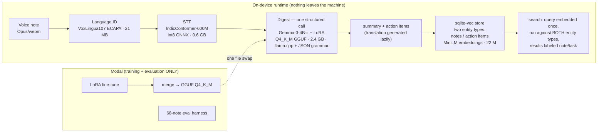
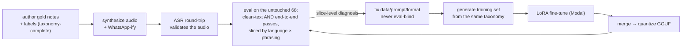

# Suno — voice-note digester for Indic languages

Speak a WhatsApp-style voice note in **Hindi, Hinglish, Tamil, or Bengali** —
Suno transcribes it, summarizes and translates it into English, extracts
**action items with a `confirmed | tentative` confidence tag**, and indexes
everything in a local vector store you can query in natural language
(*"what do I need to do for the wedding?"*). Every model runs **on-device**;
no user audio or text ever leaves the machine.

The hard problem isn't summarization — it's discipline: most family voice
notes are pure chat, and inventing a task ("call the caterer") that nobody
asked for is worse than missing one. Suno is built and *measured* around that
failure mode.

## Architecture



Design choices worth stealing:

- **One model, three trained output formats.** The same LoRA answers three
  instructions — full digest, digest-without-translation (fast path), and
  translation-only (on demand). Grammar-forcing a format the model wasn't
  trained on measurably degraded quality; *training* the formats fixed it.
- **The model only outputs what it can know.** Sender and date are app-known
  metadata: the sender is fed *into* the prompt (`From: Papa`) so summaries
  can name people without guessing, and is attached to storage records by the
  app, never generated.
- **Two searchable entity types.** Summaries and action items get separate
  embeddings, so *"what did papa say about the wedding"* (content) and
  *"what do I need to do for the wedding"* (tasks) resolve as genuinely
  different queries — with no query router to silently guess wrong.

## The taxonomy (the part that found every bug)

The evaluation design adapts the instruction taxonomy from the
[Liquid AI cookbook's home-assistant example](https://github.com/Liquid4All/cookbook/tree/main/examples/home-assistant)
to speech: every gold note is classified along dimensions that get sliced
independently in every eval run.

| Dimension | Values |
|---|---|
| Language | hi · hi-en (code-mixed) · ta · bn |
| Phrasing of the ask | **imperative** ("book the venue") · **colloquial** ("tu le lena yaar…") · **question** ("could you pick it up?") · **implicit** (no one's home to receive the delivery…) |
| Confidence | **confirmed** ("book by Friday") · **tentative** ("maybe we should think about it") |
| Boundary class | **no-action-items** — pure chat that must yield an empty list, incl. adversarial notes full of task vocabulary (sender-already-did-it reports, "I'll handle X" notes, care advice, gossip about other people's bookings) |

The gold set is 68 hand-authored notes (17/language) with labels authored
*with* the scripts, voiced by TTS, degraded to WhatsApp audio conditions, and
never trained on. The training set (938 examples) is generated from the same
taxonomy as a template × slot-fill Cartesian product — so every eval slice has
a corresponding training slice.

Slicing by taxonomy is what turned vague scores into diagnoses: it exposed
that prompt engineering only *moved* failures between phrasing styles (a
seesaw, never a lift), that the base model silently dropped tentative and
question-form asks, and it localized a training-data leak (summaries naming
senders the model couldn't know) within one query session.

## Workflow



Two invariants: the eval always runs the **exact production path** (quantized
GGUF + grammar, real STT transcripts — so quantization and speech errors are
inside the measurement), and instruction strings are **imported by the
training code from the runtime code**, making train/serve skew structurally
impossible.

## Results (held-out, end-to-end: audio → STT → quantized model)

| Metric | Base Gemma-3-4B | Fine-tuned |
|---|---|---|
| Action-item F1 | ~0.55 | **0.76** |
| Hallucinated tasks on pure-chat notes | 0.05–0.20 (prompt-dependent seesaw) | **0.10** |
| Confidence-tag accuracy | scrambled (0.17–1.0) | **0.90–1.00** |
| Translation chrF | ~47 | **~56** |
| Schema-parse failures | 0 | **0** |
| Warm latency (8 GB M2 Air, all local) | — | ~25 s/note |

Models: [LoRA adapter](https://huggingface.co/yashwork-byte/gemma-3-4b-it-voice-digest-lora) ·
[GGUF](https://huggingface.co/yashwork-byte/gemma-3-4b-it-voice-digest-GGUF) ·
[int8 STT](https://huggingface.co/yashwork-byte/indic-conformer-600m-int8-onnx)

## Setup

Prereqs: [uv](https://docs.astral.sh/uv/), `ffmpeg`, a Hugging Face token
(`HF_TOKEN` in `.env` — IndicConformer and Gemma are gated), and optionally
[Modal](https://modal.com) if you want to retrain/evaluate.

```bash
git clone https://github.com/yashwork-byte/voice-note-digester && cd voice-note-digester
cp .env.example .env          # add HF_TOKEN=hf_...
uv sync --group demo
# models: the digest GGUF and int8 STT (from the HF repos above) go under
#   data/models/gemma-3-4b-it-ft-Q4_K_M.gguf
#   data/models/indic-conformer-int8/
make demo                      # http://localhost:8000 — wait for "warmup complete"
```

Everything else is a make target: `train-data` (regenerate the training set),
`fine-tune` / `export-gguf` / `evaluate` (Modal), `synth-data` (rebuild eval
audio via TTS), `ingest` / `search` (local store), `test`.

## Credits & licenses

Code: MIT-style, do what you like. The digest model is a **Gemma derivative**
([Gemma Terms of Use](https://ai.google.dev/gemma/terms)). STT derives from
[AI4Bharat IndicConformer](https://huggingface.co/ai4bharat/indic-conformer-600m-multilingual)
(MIT). Eval audio synthesized with Sarvam Bulbul TTS. Eval-taxonomy design
inspired by the Liquid AI cookbook's home-assistant example. Eval datasets
referenced: AI4Bharat IndicVoices / BhasaAnuvaad (CC BY 4.0).
